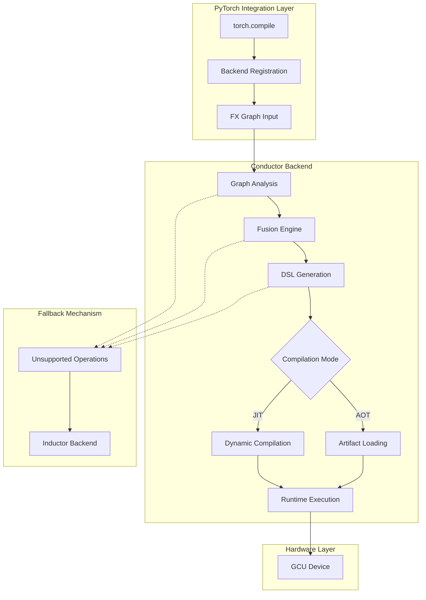

# Design Document

## Overview

The Conductor PyTorch Backend Integration provides a seamless bridge between PyTorch's FX Graph representation and the Conductor compiler for custom 'gcu' hardware acceleration. The design emphasizes minimalism, performance, and maintainability while providing robust JIT and AOT compilation modes with intelligent operation fusion and buffer management.

## Architecture

### High-Level System Architecture



### Component Architecture

The system is organized into four primary layers:

1. **Integration Layer**: PyTorch backend registration and FX Graph interface
2. **Processing Layer**: Graph analysis, fusion optimization, and DSL generation
3. **Compilation Layer**: JIT/AOT compilation pipeline and artifact management
4. **Execution Layer**: Runtime integration and hardware interface

## Components and Interfaces

### Core Data Structures

#### Buffer Class
```python
@dataclass
class Buffer:
    """Represents data flow and memory management in the computation graph."""
    name: str                    # Unique identifier for the buffer
    scope: BufferScope          # Memory scope (LOCAL, SHARED, GLOBAL)
    dtype: torch.dtype          # Data type information
    shape: Optional[Tuple[int, ...]]  # Shape when statically known
    producer: Optional['ConductorNode']  # Node that produces this buffer
    consumers: List['ConductorNode']     # Nodes that consume this buffer
    is_temporary: bool = False   # Whether this is a temporary intermediate buffer
    
    def promote_scope(self, new_scope: BufferScope) -> None:
        """Promote buffer to higher scope when needed for sharing."""
        
    def get_memory_footprint(self) -> int:
        """Calculate memory requirements for this buffer."""
```

#### ConductorNode Class
```python
@dataclass
class ConductorNode:
    """Represents a single operation in the computation DAG."""
    op_name: str                # Operation identifier (e.g., 'add', 'mul', 'relu')
    inputs: List[Buffer]        # Input buffers with dependency information
    outputs: List[Buffer]       # Output buffers produced by this operation
    metadata: Dict[str, Any]    # Operation-specific parameters and attributes
    fusion_group: Optional['FusionCluster'] = None  # Fusion cluster membership
    
    def can_fuse_with(self, other: 'ConductorNode') -> bool:
        """Determine if this node can be fused with another node."""
        
    def generate_dsl(self) -> str:
        """Generate Conductor DSL code for this operation."""
        
    def estimate_cost(self) -> float:
        """Estimate computational cost for scheduling decisions."""
```

#### FusionCluster Class
```python
@dataclass
class FusionCluster:
    """Groups compatible operations for optimization."""
    nodes: List[ConductorNode]  # Operations included in this cluster
    cluster_type: FusionType    # Type of fusion (ELEMENTWISE, REDUCTION, MIXED)
    external_inputs: List[Buffer]   # Inputs from outside the cluster
    external_outputs: List[Buffer]  # Outputs consumed outside the cluster
    internal_buffers: List[Buffer]  # Temporary buffers within the cluster
    dsl_function_name: str      # Generated DSL function identifier
    
    def validate_fusion_safety(self) -> bool:
        """Verify that fusion preserves mathematical correctness."""
        
    def generate_fused_dsl(self) -> str:
        """Generate optimized DSL code for the entire cluster."""
        
    def estimate_performance_gain(self) -> float:
        """Estimate performance improvement from fusion."""
```

### Graph Processing Pipeline

#### Graph Analysis Engine
```python
class GraphAnalyzer:
    """Analyzes FX Graph and builds internal representation."""
    
    def parse_fx_graph(self, graph_module: torch.fx.GraphModule) -> 'ComputationDAG':
        """Convert FX Graph to internal DAG representation."""
        
    def identify_data_dependencies(self, dag: 'ComputationDAG') -> None:
        """Analyze data flow and establish buffer dependencies."""
        
    def validate_graph_correctness(self, dag: 'ComputationDAG') -> bool:
        """Verify graph integrity and detect potential issues."""
```

#### Fusion Engine
```python
class FusionEngine:
    """Implements operation fusion heuristics and optimization."""
    
    def identify_fusion_opportunities(self, dag: 'ComputationDAG') -> List[FusionCluster]:
        """Find groups of operations that can be safely fused."""
        
    def apply_elementwise_fusion(self, nodes: List[ConductorNode]) -> FusionCluster:
        """Fuse consecutive elementwise operations."""
        
    def apply_reduction_fusion(self, nodes: List[ConductorNode]) -> FusionCluster:
        """Fuse elementwise operations with following reductions."""
        
    def optimize_buffer_usage(self, cluster: FusionCluster) -> None:
        """Optimize memory usage within fusion clusters."""
```

#### DSL Generator
```python
class DSLGenerator:
    """Generates Conductor DSL code from processed graph."""
    
    def generate_dsl_file(self, dag: 'ComputationDAG') -> str:
        """Generate complete DSL file for the computation graph."""
        
    def emit_buffer_declarations(self, buffers: List[Buffer]) -> str:
        """Generate buffer declarations with appropriate scoping."""
        
    def emit_operation_sequence(self, nodes: List[ConductorNode]) -> str:
        """Generate operation sequence maintaining topological order."""
        
    def optimize_temporary_variables(self, dsl_code: str) -> str:
        """Optimize temporary variable usage in generated DSL."""
```

### Compilation Pipeline

#### JIT Compilation Manager
```python
class JITCompiler:
    """Manages just-in-time compilation workflow."""
    
    def compile_graph(self, graph_module: torch.fx.GraphModule) -> 'CompiledArtifact':
        """Complete JIT compilation pipeline from FX Graph to executable."""
        
    def invoke_conductor_compiler(self, dsl_file: str) -> str:
        """Call external Conductor CLI compiler."""
        
    def load_compiled_artifact(self, artifact_path: str) -> 'ExecutableKernel':
        """Load compiled shared library using ctypes."""
        
    def cache_compilation_result(self, graph_hash: str, artifact: 'CompiledArtifact') -> None:
        """Cache compiled artifacts for reuse."""
```

#### AOT Artifact Manager
```python
class AOTManager:
    """Handles ahead-of-time compiled artifact loading."""
    
    def locate_precompiled_artifact(self, graph_signature: str) -> Optional[str]:
        """Find precompiled artifact matching graph signature."""
        
    def validate_artifact_compatibility(self, artifact_path: str, graph_module: torch.fx.GraphModule) -> bool:
        """Verify artifact compatibility with current graph."""
        
    def load_static_artifact(self, artifact_path: str) -> 'ExecutableKernel':
        """Load precompiled object file or shared library."""
```

## Data Models

### Buffer Scope Management
```python
class BufferScope(Enum):
    """Defines memory scope hierarchy for buffer management."""
    LOCAL = "local"      # Temporary variables within single kernel
    SHARED = "shared"    # Inter-kernel communication within model execution
    GLOBAL = "global"    # Persistent data across multiple model invocations

class BufferManager:
    """Manages buffer allocation and scope promotion."""
    
    def allocate_buffer(self, name: str, dtype: torch.dtype, shape: Tuple[int, ...]) -> Buffer:
        """Allocate new buffer with appropriate initial scope."""
        
    def promote_buffer_scope(self, buffer: Buffer, required_scope: BufferScope) -> None:
        """Promote buffer to higher scope when sharing is required."""
        
    def optimize_buffer_reuse(self, buffers: List[Buffer]) -> Dict[str, str]:
        """Identify opportunities for buffer reuse to reduce memory footprint."""
```

### Fusion Type Classification
```python
class FusionType(Enum):
    """Categorizes different types of operation fusion."""
    ELEMENTWISE = "elementwise"      # Pure elementwise operation chains
    REDUCTION = "reduction"          # Elementwise followed by reduction
    MIXED = "mixed"                  # Complex fusion patterns
    MEMORY_BOUND = "memory_bound"    # Memory bandwidth limited operations
    COMPUTE_BOUND = "compute_bound"  # Computation intensive operations

class FusionHeuristics:
    """Implements fusion decision logic."""
    
    def can_fuse_elementwise(self, op1: str, op2: str) -> bool:
        """Determine if two elementwise operations can be fused."""
        
    def estimate_fusion_benefit(self, nodes: List[ConductorNode]) -> float:
        """Estimate performance benefit of fusing given nodes."""
        
    def check_memory_constraints(self, cluster: FusionCluster) -> bool:
        """Verify fusion doesn't exceed memory limitations."""
```

## Error Handling

### Exception Hierarchy
```python
class ConductorError(Exception):
    """Base exception for all Conductor-related errors."""
    pass

class CompilationError(ConductorError):
    """Raised when DSL compilation fails."""
    def __init__(self, message: str, dsl_code: str, compiler_output: str):
        self.dsl_code = dsl_code
        self.compiler_output = compiler_output
        super().__init__(message)

class UnsupportedOperationError(ConductorError):
    """Raised when an operation cannot be converted to Conductor DSL."""
    def __init__(self, operation: str, reason: str):
        self.operation = operation
        self.reason = reason
        super().__init__(f"Unsupported operation '{operation}': {reason}")

class FallbackHandler:
    """Manages graceful fallback to alternative backends."""
    
    def should_fallback(self, error: Exception) -> bool:
        """Determine if error should trigger fallback mechanism."""
        
    def execute_fallback(self, graph_module: torch.fx.GraphModule) -> Callable:
        """Execute fallback compilation using Inductor backend."""
```

### Logging and Diagnostics
```python
class ConductorLogger:
    """Centralized logging for debugging and monitoring."""
    
    def log_compilation_start(self, graph_hash: str, node_count: int) -> None:
        """Log beginning of compilation process."""
        
    def log_fusion_decision(self, nodes: List[str], decision: bool, reason: str) -> None:
        """Log fusion decisions for debugging optimization."""
        
    def log_performance_metrics(self, compilation_time: float, execution_time: float) -> None:
        """Log performance metrics for monitoring."""
```

## Testing Strategy

### Unit Testing Framework
- **Graph Analysis Tests**: Validate FX Graph parsing and DAG construction
- **Fusion Logic Tests**: Verify correctness of fusion heuristics and safety checks
- **DSL Generation Tests**: Ensure generated DSL matches expected patterns
- **Buffer Management Tests**: Validate scope promotion and memory optimization

### Integration Testing Framework
- **End-to-End Pipeline Tests**: Complete JIT and AOT workflow validation
- **Performance Regression Tests**: Benchmark against baseline implementations
- **Compatibility Tests**: Verify compatibility across PyTorch versions and platforms
- **Fallback Mechanism Tests**: Ensure graceful handling of unsupported operations

### FileCheck Validation
- **DSL Correctness**: Use LLVM FileCheck to validate generated DSL structure
- **Optimization Verification**: Confirm fusion optimizations are applied correctly
- **Buffer Scope Validation**: Verify appropriate buffer scope assignments
- **Topological Ordering**: Ensure generated code maintains correct execution order

## Performance Considerations

### Compilation Optimization
- **Caching Strategy**: Intelligent caching of compiled artifacts based on graph signatures
- **Incremental Compilation**: Reuse compilation results for similar graph structures
- **Parallel Processing**: Utilize multiple cores for independent compilation tasks
- **Memory Management**: Minimize memory footprint during graph processing

### Runtime Optimization
- **Lazy Loading**: Load compilation components only when needed
- **Buffer Reuse**: Aggressive buffer reuse to minimize memory allocation overhead
- **Kernel Fusion**: Maximize fusion opportunities to reduce kernel launch overhead
- **Memory Locality**: Optimize data layout for cache efficiency

### Scalability Considerations
- **Large Graph Handling**: Efficient algorithms for processing graphs with thousands of nodes
- **Memory Constraints**: Graceful handling of memory-limited environments
- **Compilation Time Limits**: Timeout mechanisms for long-running compilations
- **Resource Monitoring**: Track and limit resource usage during compilation